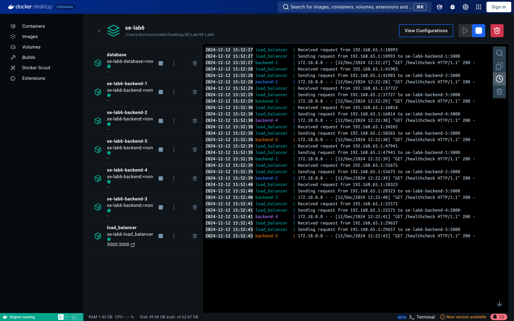
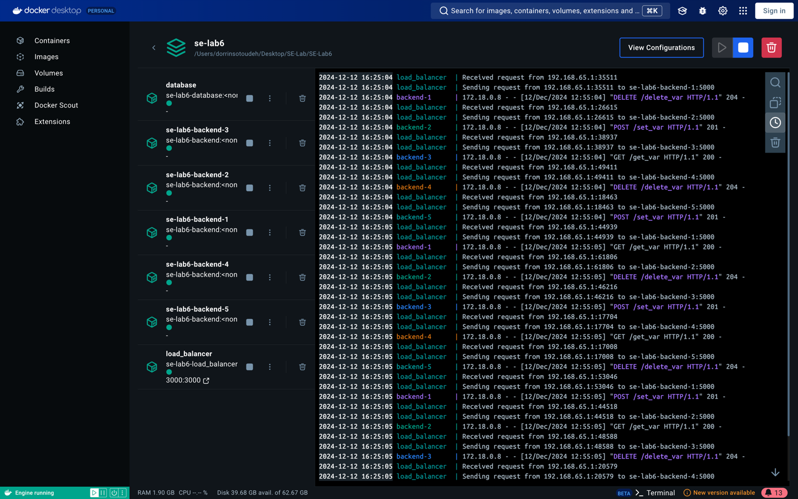
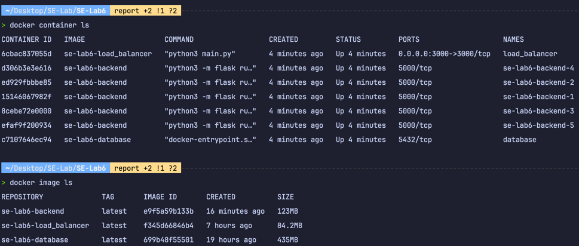

# آزمایش ششم: استقرار با استفاده از  داکر
## سرورها
برای سرورها یک
API
ساده با استفاده از چاروب
Flask
ساختیم. فایل‌های این قسمت در پوشه‌ی
backend/
ثرار گرفتند.
داکرفایل بک‌اند هم داخل همین پوشه قرار دارد.
مهم‌ترین APIهای این قسمت عبارتند از
```
GET /healthcheck        <--- Simple Healthcheck 
POST /set_var           <--- Create a key/value variable in database
GET /get_var            <--- Retrieve a variable value from database by its key
PUT /edit_var           <--- Edit a variable's value in database by its key
DELETE /delete_var      <--- Delete a variable from database by its key
```
سرور ما به کانتینر 
database
که جلوتر توضیح داده می‌شود وصل میشود و امکان انجام عملیات‌های ساده 
CRUD
را به ما می‌دهد.
سرور از طریق یک سری 
Environment Variable
که در فایل داکر-کومپوز در اختیار گرفته به دیتابیس وصل میشود و این عملیات را انجام میدهد. کتابخانه‌ی 
psycopg
به عنوان واسط برای اتصال به سرور استفاده شده است.

محتویات داکرفایل این قسمت بصورت زیر است.
```dockerfile
FROM python:3.11-alpine

WORKDIR backend

COPY backend/requirements.txt requirements.txt
RUN pip3 install --upgrade pip
RUN pip3 install -r requirements.txt

ENV FLASK_APP=backend/app.py
ENV FLASK_ENV=development
ENV FLASK_DEBUG=0
ENV FLASK_RUN_HOST=0.0.0.0
ENV FLASK_RUN_PORT=5000

COPY backend .

EXPOSE 5000

CMD ["python3", "-m", "flask", "run", "-h", "0.0.0.0", "-p", "5000"]
```
در این فایل ابتدا 
python:3.11
را
pull
میکنیم. سپس 
cwd
را پوشه‌ی
backend
قرار می‌دهیم و فایل 
requirements.txt
را به کنتینر کپی کرده و کتابخانه‌ها را
install 
میکنیم. سپس تعدادی متغیر محیطی را مقداردهی میکنیم و سایر فایل‌ها را کپی میکنیم. در نهایت پورت ۵۰۰۰ را 
Expose
میکنیم و دستور اجرای برنامه را اجرا میکنیم.

## دیتابیس
برای دیتابیس ما از 
PostgreSQL
استفاده کردیم. برای این کار ابتدا یک 
script
ساده برای ساخت جدول نوشتیم و سپس در
Dockerfile
آن این
script
را به پوشه‌ی
docker-entrypoint-initdb.d
کپی کردیم. اینگونه وقتی کانتینتر اجرا میشود، دستورات ما هم اجرا خواهند شد و جداول ساخته میشوند.
```sql
CREATE TABLE public.variables (
    key text PRIMARY KEY,
    value text NOT NULL
);

ALTER TABLE public.variables OWNER TO postgres;
```
```dockerfile
FROM postgres:latest

COPY database/db_script.sql /docker-entrypoint-initdb.d/
```

## سرور واسط (Load Balancer)
این قسمت از آزمایش با استفاده از 
Socket Programming
به سادگی قابل انجام است. بدین صورت که از ساختار داده‌ی
cycle 
برای ساختن یک 
Iterator
چرخشی استفاده شده است (تعداد سرور‌های بک‌اند توسط متغیر محیطی 
SERVER_COUNT
در داکرکومپوز مشخص شده است.)

درخواست‌های 
TCP 
از آدرس
LB_HOST:LB_PORT
(متغیرهای محیطی تعیین شده در داکرکومپوز) دریافت میشوند و به سروری که توسط
cycle
مشخص شده و پورت ۵۰۰۰ ارسال میشود. وقتی پاسخ درخواست از سرور بازگشت، این پاسخ توسط واسط به مبدا برگردانده میشود.

داکرفایل ایم قسمت مانند قسمت سرور بک‌اند است و ابتدا
cwd
را مشخص میکند، سپس 
requirements.txt
را به کانتینر کپی میکند و
dependancyهارا 
install
میکند. در نهایت سایر فایل‌ها را کپی کرده و برنامه را اجرا میکند.

```dockerfile
FROM python:3.11-alpine

WORKDIR load_balancer

COPY load_balancer/requirements.txt requirements.txt
RUN pip3 install --upgrade pip
RUN pip3 install -r requirements.txt

COPY load_balancer .

EXPOSE 3000

CMD ["python3", "main.py"]
```

## داکرکومپوز
برای بالا آوردن داکر کومپوز دستور زیر را اجرا میکنیم.
```shell
PG_PASS=se_lab6_password;SERVER_COUNT=5; docker compose -f compose.yaml -p se-lab6 up;
```
اینگونه میتوان بدون نیاز به تغییرات مکرر در داکرکومپوز و همچنین به منظور رعایت امنیت رمز دیتابیس، متغیر‌های PG_PASS و SERVER_COUNT را به آن پاس دهیم.
```yaml
services:
  database:
    container_name: database
    build:
      context: .
      dockerfile: database/Dockerfile
    environment:
      POSTGRES_PASSWORD: $PG_PASS
      POSTGRES_DB: "se_lab6"

  backend:
    build:
      context: .
      dockerfile: backend/Dockerfile
    deploy:
      restart_policy:
        condition: on-failure
        delay: 5s
        max_attempts: 3
        window: 120s
      mode: replicated
      replicas: $SERVER_COUNT
    environment:
      PGSQL_DBNAME: "se_lab6"
      PGSQL_USER: "postgres"
      PGSQL_PASSWORD: $PG_PASS
      PGSQL_HOST: "database"
      PGSQL_PORT: "5432"
    depends_on:
      - database

  load_balancer:
    container_name: load_balancer
    build:
      context: .
      dockerfile: load_balancer/Dockerfile
    deploy:
      restart_policy:
        condition: on-failure
        delay: 5s
        max_attempts: 3
        window: 120s
    environment:
      PYTHONUNBUFFERED: 1
      SERVER_COUNT: $SERVER_COUNT
      LB_HOST: 0.0.0.0
      LB_PORT: 3000
    ports:
      - "3000:3000"
    depends_on:
      - backend
```
نکات مهم درباره‌ی این فایل به شرح زیر است:
سه سرویس داریم:
- database: این سرویس فایل Dockerfile موجود در پوشه‌ی database را اجرا میکند. متغیر‌های محیطی POSTGRES_PASSWORD و POSTGRES_DB برای imageای که pull کردیم لازم هستند.
- backend: این سرویس فایل Dockerfile موجود در پوشه‌ی backend را اجرا میکند.
    - در صورت بروز خطا در این سرور‌ها بصورت خودکار تا ۳ بار ریستارت میشوند.
    - این سرو‌ها بصورت replicated هستند. یعنی از یک image به تعداد متغیر replicas کانتینر ساخته میشود. مقدار متغیر replicas را نیز برابر $SERVER_COUNT که پیش‌تر بیان شد، قرار می‌دهیم.
    - این کانتینر وابسته به کانتینر database است که در ترتیب اجرا و توقف آن تاثیرگذار است.
    - تعدادی متغیر محیطی برای اتصال به دیتابیس به این کانتینر پاس داده شده است.
- load_balancer: این سرویس فایل Dockerfile موجود در پوشه‌ی load_balancer را اجرا میکند.
    - این سرویس نیز مانند بک‌اند درصورت بروز خطا restart میشود.
    - پورت ۳۰۰۰ این سرویس به پورت ۳۰۰۰ کامپیوتر ما فوروارد میشود. این موضوع امکان برقراری ارتباط از بیرون را به ما میدهد.
    - تعدادی متغیر محیطی برای تعداد سرور‌های بک‌اند که باید زمان‌بندی بشوند و همچنین آدرسی که واسط ما باید روی آن گوش کند قرار داده‌ایم.
    - این سرویس هم به سرویس database وابسته است.

## تصاویر




## سوالات
در این بخش به پرسش‌های مطرح‌شده پاسخ می‌دهیم:
**مفهوم Stateless چیست و چگونه در این آزمایش از آن استفاده کرده‌ایم؟**

در سامانه‌های کامپیوتری، «Stateless» به این معناست که هر درخواست به‌صورت مستقل پردازش می‌شود و سرور هیچ اطلاعاتی از وضعیت یا تاریخچهٔ درخواست‌های قبلی نگه‌داری نمی‌کند. به‌عبارت‌دیگر، هر درخواست حاوی تمام اطلاعات موردنیاز برای پردازش است و وابستگی به تعاملات پیشین ندارد. این رویکرد باعث کاهش پیچیدگی سرور و افزایش مقیاس‌پذیری می‌شود.

در این آزمایش، سرورهای بک‌اند با استفاده از چارچوب Flask طراحی شده‌اند که به‌صورت پیش‌فرض Stateless هستند. این بدان معناست که هر درخواست به‌طور مستقل پردازش می‌شود و سرور وضعیت یا «State» خاصی را بین درخواست‌ها حفظ نمی‌کند. این ویژگی به ما امکان می‌دهد تا به‌راحتی چندین نمونه از سرور را اجرا کرده و با استفاده از Load Balancer، ترافیک را بین آن‌ها توزیع کنیم، بدون نگرانی از هماهنگی وضعیت بین سرورها.

**تفاوت‌های Load Balancing در لایه‌های ۴ و ۷ مدل OSI چیست و مزیت‌های هرکدام نسبت به دیگری چیست؟ در این آزمایش از Load Balancing در کدام لایه استفاده کرده‌اید؟**

Load Balancing یا توزیع بار، فرآیندی است که ترافیک شبکه را بین چندین سرور توزیع می‌کند تا کارایی و قابلیت اطمینان سامانه افزایش یابد. این عمل می‌تواند در لایه‌های مختلف مدل OSI انجام شود که هرکدام ویژگی‌ها و مزایای خاص خود را دارند:

- **Load Balancing در لایه ۴ (لایه انتقال):** در این روش، توزیع بار بر اساس اطلاعات لایه انتقال، مانند آدرس‌های IP منبع و مقصد و پورت‌های TCP یا UDP انجام می‌شود. Load Balancer در این لایه بدون بررسی محتوای بسته‌ها، ترافیک را به سرورها هدایت می‌کند. مزیت اصلی این روش، سرعت بالاتر و کاهش سربار پردازشی است، زیرا نیازی به تحلیل محتوای بسته‌ها نیست. بااین‌حال، این روش انعطاف‌پذیری کمتری در تصمیم‌گیری‌های مسیریابی دارد.
- **Load Balancing در لایه ۷ (لایه کاربرد):** در این روش، Load Balancer محتوای بسته‌ها را بررسی کرده و بر اساس اطلاعاتی مانند URL، هدرهای HTTP، کوکی‌ها و نوع داده، تصمیم‌گیری می‌کند که ترافیک را به کدام سرور هدایت کند. این روش امکان توزیع هوشمندانه‌تر ترافیک را فراهم می‌کند؛ برای مثال، می‌تواند ترافیک مربوط به منابع خاصی را به سرورهای مشخصی هدایت کند. اما به دلیل نیاز به پردازش و تحلیل محتوای بسته‌ها، سربار پردازشی بیشتری دارد.

در این آزمایش، Load Balancer طراحی‌شده در لایه ۴ عمل می‌کند. با استفاده از برنامه‌نویسی سوکت و ساختار دادهٔ چرخه‌ای (cycle)، درخواست‌های TCP را از آدرس مشخص‌شده دریافت کرده و بدون بررسی محتوای آن‌ها، به‌صورت چرخشی به یکی از سرورهای بک‌اند در پورت ۵۰۰۰ ارسال می‌کند. این روش ساده و کارآمد است و با توجه به Stateless بودن سرورهای بک‌اند، نیازی به حفظ وضعیت بین درخواست‌ها وجود ندارد. 